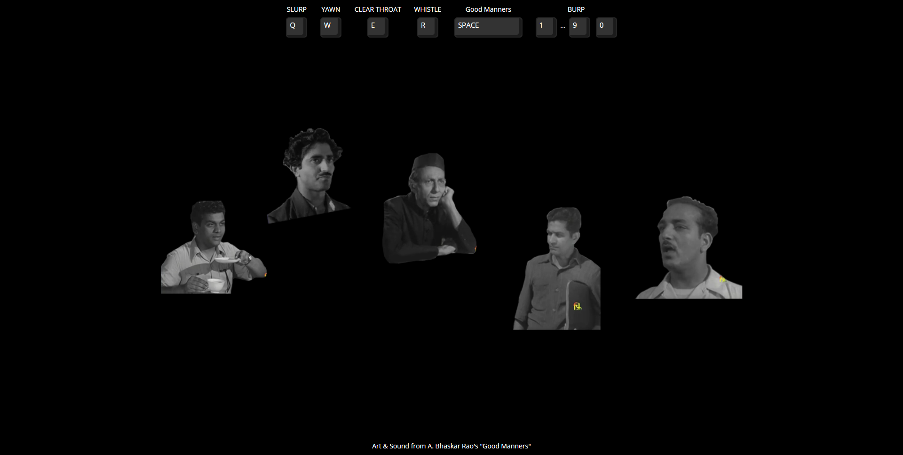

# The Orchestra Is Complete

## Inspired by [Good Manners](https://www.youtube.com/watch?v=UEQ24lIGaa0) a Film by A. Bhaskar Rao

    

## Song Examples

Happy Birthday to You

> 1 1 3 1 6 5\
> 1 1 3 1 8 6

## Thank you to

- [Externalizable](https://github.com/Externalizable) for creating bongo.cat which was the backbone of this project!
- [Hamza Kuvawala](https://www.instagram.com/hamzajustwantstochill/) for helping with the music!
- [Amogh Warkhandkar](https://github.com/amogh-w) for helping with the code!

## License

This project is licensed under the MIT License - see the [LICENSE](https://github.com/Externalizable/bongo.cat/blob/master/LICENSE) file for details
